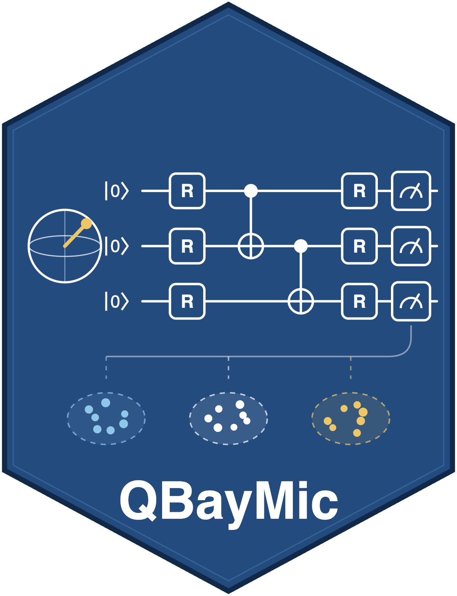
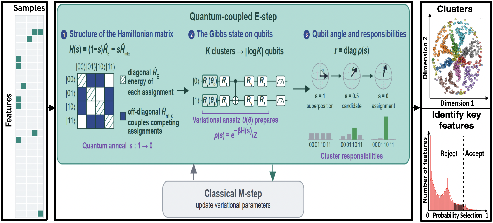

<table border="0">
  <tr>
    <td>
      
    </td>
    <td>
      <h1>QBayMic — Quantum Bayesian Microbiome</h1>
      <h3>Tung Dang, Artem Lysenko, and Tatsuhiko Tsunoda (2026). bioRxiv, 2026-09-18. doi: https://doi.org/10.64898/2026.09.14.751634</h3>
    </td>
  </tr>
</table>

## The workflow of QBayMic



QBayMic fits a **Dirichlet–multinomial mixture with stochastic variable
selection** (DMM-SVVS) to microbiome count data, and lets you run the E-step with a **quantum** engine. A barrier diagnostic, the *signal fraction* **σ**, predicts *before* clustering whether the quantum E-step will
provide an advantage.

All methods share one variational objective and one scikit-learn-style
interface — they differ only in how the E-step responsibilities are computed.

| method       | E-step                                        | type                |
|--------------|-----------------------------------------------|---------------------|
| `ed`         | exact quantum Gibbs E-step (diagonalisation)  | quantum (exact)     |
| `varqite`    | variational imaginary-time evolution          | quantum (circuit)   |
| `vqt`        | variational quantum thermalizer               | quantum (circuit)   |

## Install

```bash
git clone <this-repo> && cd QBayMic-main
pip install -r requirements.txt
```

The quantum methods (`ed`, `varqite`, `vqt`) need PennyLane (CPU builds are sufficient).

## Quickstart

```python
from qbaymic import QBayMic, make_counts, signal_fraction, regime
from sklearn.metrics import adjusted_rand_score

# Synthetic microbiome counts in the advantage band (σ ≈ 0.29)
X, y = make_counts(n_samples=400, n_taxa=5000, n_clusters=3,
                   separation=0.2, zero_inflation=0.80, seed=0)

# The recoverability diagnostic — no clustering run needed
sig = signal_fraction(N=400, S=5000, K=3, separation=0.2, zero_inflation=0.80)
print(sig["sigma"], regime(sig["sigma"]))          # ≈ 0.29, "advantage band"

# Fit the exact quantum E-step and score it
model = QBayMic(method="vqt", K_max=4, random_state=0).fit(X)
print(model.K_, adjusted_rand_score(y, model.labels_))
```

`X` is an integer count matrix of shape `(n_samples, n_taxa)`. `K_max`
over-specifies the number of clusters; the effective `K` is inferred by pruning.

## The signal fraction σ

σ = B_signal / B ∈ [0, 1] orders clustering **difficulty**, where `B` is the
between-cluster barrier height and `B_signal` is the part due to genuine
separation (rather than finite-sample noise). It predicts the regime:

| σ            | regime            | behaviour                                    |
|--------------|-------------------|----------------------------------------------|
| ≲ 0.20       | unrecoverable     | no method succeeds                           |
| ≈ 0.25–0.45  | **advantage band**| the quantum E-step separates from classical  |
| ≳ 0.45       | signal-dominated  | all methods succeed (small quantum margin)   |

## Examples

```bash
python examples/01_quickstart.py          # data → σ → fit → ARI
python examples/02_quantum_vs_classical.py # all six methods on one instance
```

## Tests

```bash
python -m pytest tests/          # or: python tests/test_smoke.py
```


## License

See `LICENSE`.
